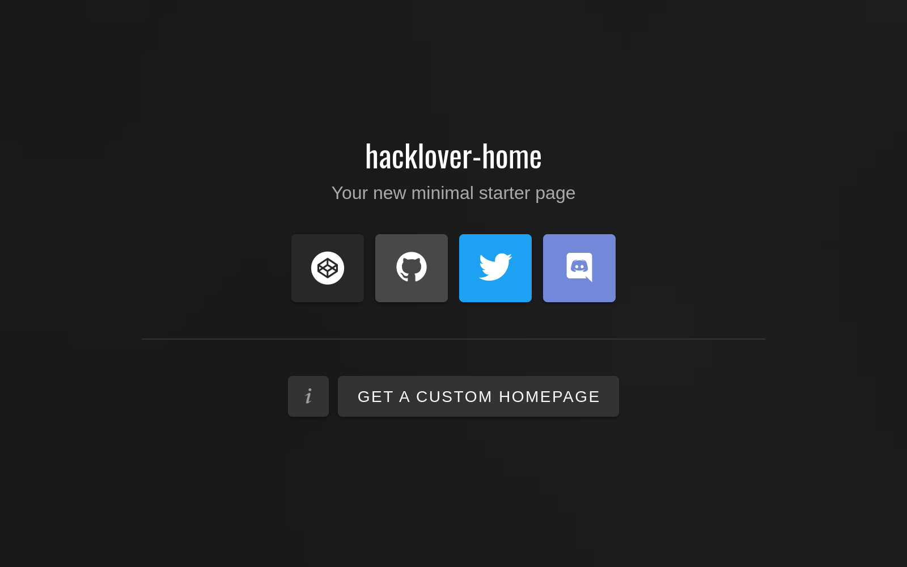

# hacklover-home

<p>
    
</p>

## Overview

hacklover-home is based on Vue.js 3 and is configurable with a JSON file.  
Your page can be local or loaded directly from an external source.

**hacklover-home** is a self-hosted solution:
- download the zip file and extract it
- install dependencies with `yarn install`
- launch the dev server with `yarn dev`
- edit your page in `config/page.json`
- build the project and host it somewhere


## Configuration

### main.json
Your page can be `local` or `remote` depending on your needs.  
```json
{
  "page": {
    "type": "remote",
    "url": "https://ipfs.io/ipfs/QmY7i6dEji5fbzLo86GWJJLEqsGNMCxKTEC6hucVwrFgF2"
  }
}
```

### page.json
Page configuration in detail.
```json
{
  "title": "hacklover-home",
  "description": "Your new minimal starter page",
  "links": [],
  "about": {
    "description": "",
    "buttons": []
  },
  "footer": {
    "buttons": [],
    "action": {
      "text": "Get a custom homepage",
      "href": "https://patreon.com/hacklover"
    }
  }
}
```

#### Button object
Button configuration in detail.
```json
{
  "class": "",
  "icon": {
    "name": "mdi-discord",
    "size": 23,
    "style": {
      "marginTop": "-2px"
    }
  },
  "href": "https://discord.gg/cYyfjpK7RD",
  "target": "_blank"
}
```
